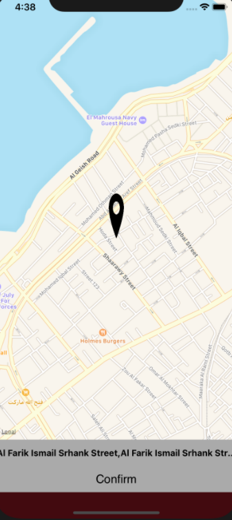
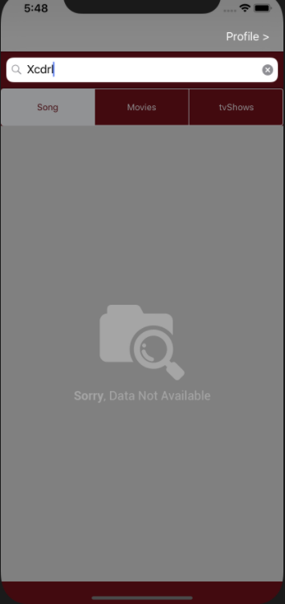

# Media-Finder
An application to play movies, songs or Tv-shows from iTunes Search API by using Alamofire and pars the data. 
Store the user data and the last search result for each user in a database by using SQLite. 
# 1- Sign Up View
It contains user name, user email, password, user image, user gender and user address. 
 When the user clicks on Sign Up button 
- In case he/she entered invalid data or the user data entry is not completed he/she should see an alert tell him/her what is wrong.
  
 
- In case he/she clicks on the image button the image picker will allow the user to pick an image from the galary when he/she choose the image the sign up view will display.
  
 
- In case he/she clicks on the address the map view will display and allow the user to get the address from the center location of the map then click confirm to send the address and the sign up view will display.
  
 
- Sign up view after getting the address and the map.
  
 

# 2- Sign In View
It contains user email and password. 
- In case the user already has an account and he/she try to log in via Sign In screen you must validate email and password as in the database. 
- In case he/she entered invalid data he/she should see an alert tell him/her what is wrong. 
- In case he/she entered valid data you must check if these credentials exist on the database or not to decide to let him/her in or alert him/her with invalid credentials alert. 
  
 

# 3- Media List View
It contains a search bar for the Media name ,Sigmented buttons to choose the type of the media (movies-songs-tv-shows) and a table view to show the result of the search. 
Examples: 
- The user has searched for Adele and of type song.
  
 
- The user has searched for xmen and of type movie.
  
 
- The user has searched for xmen and of type tv-show.
  
 
- The user has searched for something with no result.
  
 

# 4-Profile
It contains the user information.
  
 
